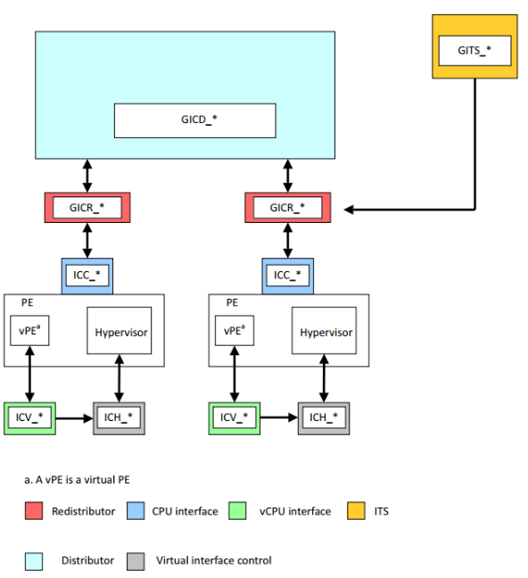
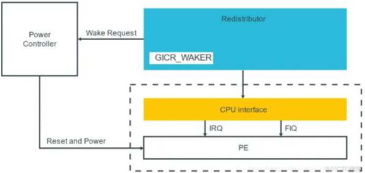

最近调试了一个bug，bug本身没有任何意义，但是由此引发了我对中断控制器的思考，当然之前的中断控制器GIC的代码开发不是我负责，不过做多核唤醒的时候还是研究了一番，正好结合最近的思考总结一下 :frog:

# 背景
起因是bringup的时候发现，需要打开local interrupt enable才能让zero-riscy的core去响应外部中断，这个说起来好理解，zero-riscy是没有中断控制器的，它的外部中断都是直接连线接到core的中断线上，这个c906这种带有中断控制器的cpu是有很大不同的，bug的起因是代码是从c906上移植的，中断处理的流程不一样，这就引出了中断处理的流程：

那么中断控制器在这里面有什么作用呢？

- 可以管理大量的中断，让CPU有了处理大量中断的能力，riscv有PLIC和CLIC分别用于管理外部中断和local中断，PLIC可以接很多个外设，都可以发中断。intel早期的中断控制器8259A可以接8根中断线，让8086有了处理多个中断的能力

- 对中断进行优先级管理，PLIC的中断主要是外设优先级高于CLIC，CLIC主要是软中断和定时器中断（这俩通常可以用于主动调度的实现，所以说处理外部中断的时间需要尽可能的短）。高优先级中断会先被CPU处理。
- 多核CPU的中断任务分发，可以对中断处理进行负载均衡，以及设置亲和性
- 状态管理，多个中断发生的时候需要对中断的状态进行管理，而不是像没有中断控制器的场景下去直接忽略在处理中断过程中发生的其他中断
# GIC
燕国地图太短了，这就到了主题了，这篇blog主要是想整理下GIC中断控制器的一些基础知识，因为GIC毕竟是在上述三个特点都满足的场景下实操过的，不像PLIC，在当前项目中看来完全是多余了，就像有人找我讨论问是否有需要用C908…，C906都多余用，用个zero-riscy绰绰有余了…

带有中断控制器的中断处理流程是怎么样的呢？

从这个图就可以看出，CPU与GIC是“握手”的关系

1. 外设 -> GIC：中断信号
2. GIC -> CPU：（Assert）拉对应的中断线
3. CPU -> GIC：读IAR（中断应答，获取ID，类似于裸core在查询mcause一样）
4. CPU -> GIC： 写EOI，中断处理完成

当然这个“握手”跟TCP的握手不同，它不是基于发包的形式的，而是通过配置GIC的寄存器来实现的，GIC的配置寄存器被映射到MMIO空间，
比如GICD_* Distributor寄存器和GICC_* CPU Interface寄存器
CPU对GIC的所有操作（例如：读IAR来确认中断、写EOI来结束中断、设置优先级掩码、配置中断路由等）都是通过普通的内存读写指令（如LDR, STR）来访问这些特定的物理地址完成的。

# GIC的主要模块
## GIC逻辑框架

## 中断的类型
- SPI(shared peripheral interrupt)：可以配置affinity来路由到指定的cpu上，一般连接外设中断。中断号32-1019
- PPI(private peripheral interrupt): 处理器私有中断，一个中断只会路由到特定的处理器上。在多核系统中同一个PPI中断号可以定义为不同的私有中断。中断号16-31
- SGI(software generated interrupt)：软件中断，主要有用于核间通信IPI， 中断号0-15
- LPI(locality-specific peripheral interrupt)：基于消息的中断，不需要中断线的连接，可以通过向特定地址写入消息来触发中断。典型的应用是**PCIe的MSI**中断，对于LPI可以经过或者不经过ITS的翻译，也没有active状态，也不需要显示的deactivation操作，这个其实固件中处理的比较少，应该主要是OS中会有相应的设计

## 模块与中断之间的配置关系
### GICD 
对全局属性和SPI外设中断进行配置，中断触发时根据寄存器设定的中断分组、优先级和亲和性配置将SPI和SGI路由到指定的redistributor和cpu interface上。主要的配置包括：
- 中断使能配置，特定中断号是否使能
- 中断触发方式
  - 边沿触发：检测到边沿就触发中断assert，并一直保持，直到软件应答这个中断
  - 电平触发：检测到特定的电平触发中断assert，电平变化或者软件应答都可以deassert
- 中断优先级
- 中断亲和性，待补充
- 中断分组配置：
  - group0中断：被EL3处理
  - secure group1 : 被secure el1或secure el2
  - non secure group1: 被non secure el1或non secure el2
- 中断状态控制，可以由软件设置终中断为pending、active状态

### GICR
包含两部分功能

- 作为编程接口，软件通过GICR寄存器来对PPI和SGI的中断属性进行配置，以及电源管理和LPI中断管理
- 把优先级最高的pending中断发送到CPU interface上
#### 电源管理部分
GICR_WAKER寄存器，用于与之相连的PE的状态是online还是offline，如果PE状态是offline想要变成online则软件需要：
step 1. clear GICR_WAKER.ProcessorSleep to 0.
step 2. poll GICR_WAKER.ProcessorSleep to 0.

具体流程是：pe offline收到中断，产生wake request信号，连接到PE的power controller，这个controller打开pe，然后pe去做上述的step 1和2，这个其实就是C2000当中的唤醒核/thread的操作，不同的是C2000的PE是thread

CPU interface和PE在同一个power domain，但是GICR不跟他们在同一个power domain，所以GICR可以用GICR_WAKER这个寄存器来记录PE的状态
#### LPI管理
LPI支持的终端数量众多（涉及PCIe的MSI/MSI-X），因此需要在GIC初始化的时候分配一块内存交给GIC用来存储LPI的各种配置和状态