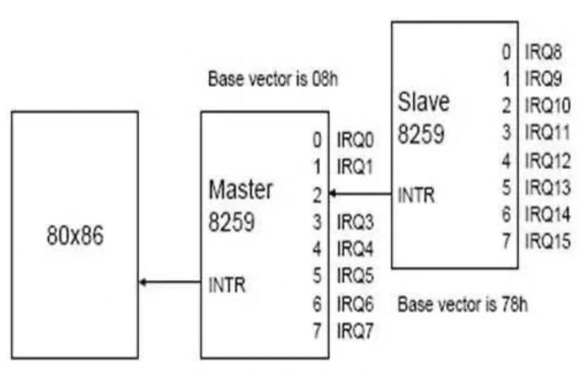
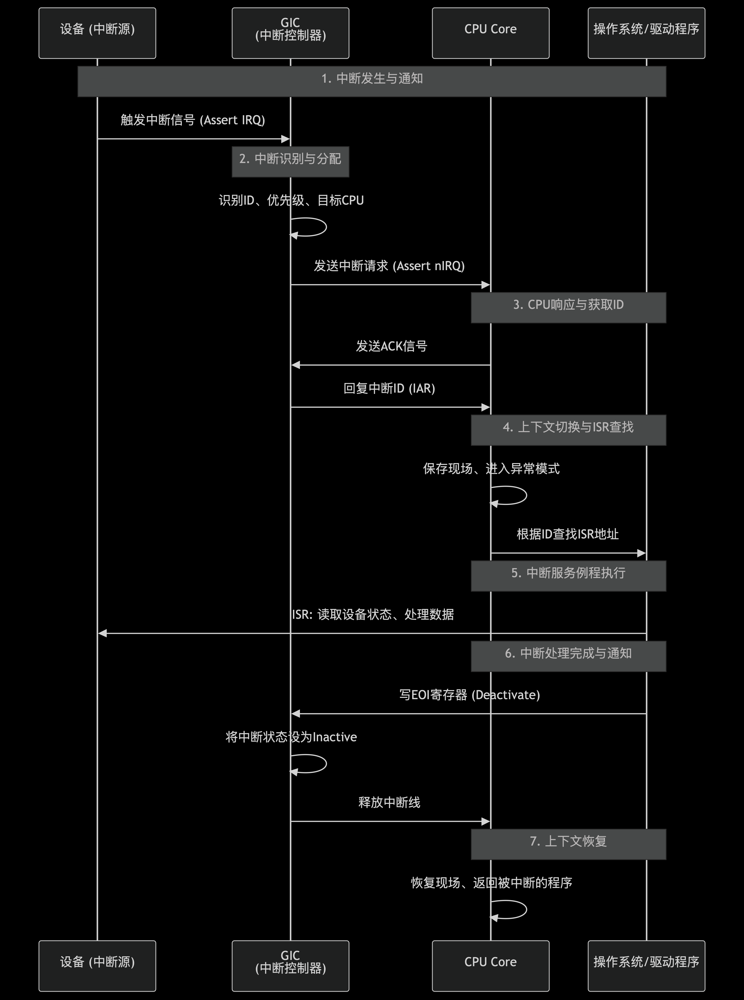

最近调试了一个bug，bug本身没有任何意义，但是由此引发了我对中断控制器的思考，当然之前的中断控制器GIC的代码开发不是我负责，不过做多核唤醒的时候还是研究了一番，正好结合最近的思考总结一下 :frog:

# 背景
起因是bringup的时候发现，需要打开local interrupt enable才能让zero-riscy的core去响应外部中断，这个说起来好理解，zero-riscy是没有中断控制器的，它的外部中断都是直接连线接到core的中断线上，这个c906这种带有中断控制器的cpu是有很大不同的，bug的起因是代码是从c906上移植的，中断处理的流程不一样，这就引出了中断处理的流程：

那么中断控制器在这里面有什么作用呢？

- 可以管理大量的中断，让CPU有了处理大量中断的能力，riscv有PLIC和CLIC分别用于管理外部中断和local中断，PLIC可以接很多个外设，都可以发中断。intel早期的中断控制器8259A可以接8根中断线，让8086有了处理多个中断的能力

- 对中断进行优先级管理，PLIC的中断主要是外设优先级高于CLIC，CLIC主要是软中断和定时器中断（这俩通常可以用于主动调度的实现，所以说处理外部中断的时间需要尽可能的短）。高优先级中断会先被CPU处理。
- 多核CPU的中断任务分发，可以对中断处理进行负载均衡，以及设置亲和性
- 状态管理，多个中断发生的时候需要对中断的状态进行管理，而不是像没有中断控制器的场景下去直接忽略在处理中断过程中发生的其他中断
# GIC
燕国地图太短了，这就到了主题了，这篇blog主要是想整理下GIC中断控制器的一些基础知识，因为GIC毕竟是在上述三个特点都满足的场景下实操过的，不像PLIC，在当前项目中看来完全是多余了，就像有人找我讨论问是否有需要用C908…，C906都多余用，用个zero-riscy绰绰有余了…

带有中断控制器的中断处理流程是怎么样的呢？

从这个图就可以看出，CPU与GIC是“握手”的关系

1. 外设 -> GIC：中断信号
2. GIC -> CPU：（Assert）拉对应的中断线
3. CPU -> GIC：读IAR（中断应答，获取ID，类似于裸core在查询mcause一样）
4. CPU -> GIC： 写EOI，中断处理完成

当然这个“握手”跟TCP的握手不同，它不是基于发包的形式的，而是通过配置GIC的寄存器来实现的，GIC的配置寄存器被映射到MMIO空间，
比如GICD_* Distributor寄存器和GICC_* CPU Interface寄存器
CPU对GIC的所有操作（例如：读IAR来确认中断、写EOI来结束中断、设置优先级掩码、配置中断路由等）都是通过普通的内存读写指令（如LDR, STR）来访问这些特定的物理地址完成的。

